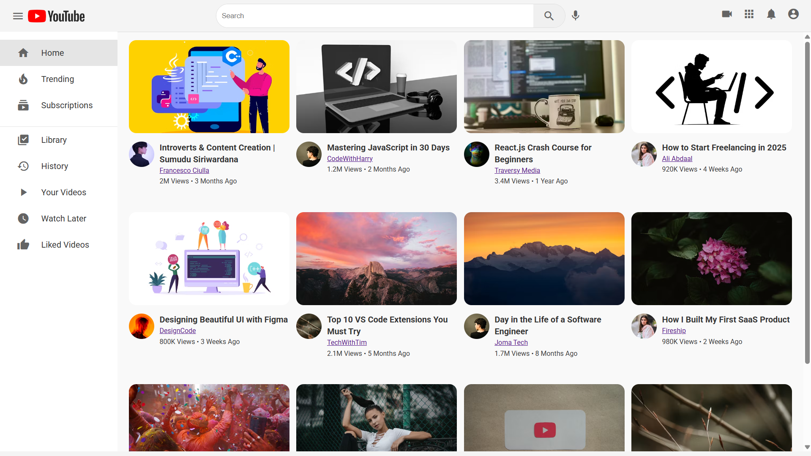

# YouTube-UI-Clone

YouTube Frontend UI Clone

## **Description:**
This project is a responsive front-end clone of the YouTube video browsing interface. It replicates the core visual structure of YouTube's homepage, featuring a grid layout of video cards that include thumbnails, video titles, author profiles, channel names, view counts, and timestamps.

Each video card is structured with semantic HTML and styled using modern CSS practices to mimic YouTube’s familiar design. The layout is fully responsive and adaptable across various screen sizes, offering a smooth user experience.

This clone was built purely for learning and demonstration purposes, with a focus on mastering layout techniques, reusable components, and media-rich UI design.

[Visit the App](https://udayige.github.io/YouTube-UI-Clone/)
## **Output**

---

## **License**

This project is licensed under the **MIT License**.  
See the [LICENSE](./LICENSE) file for more details.
